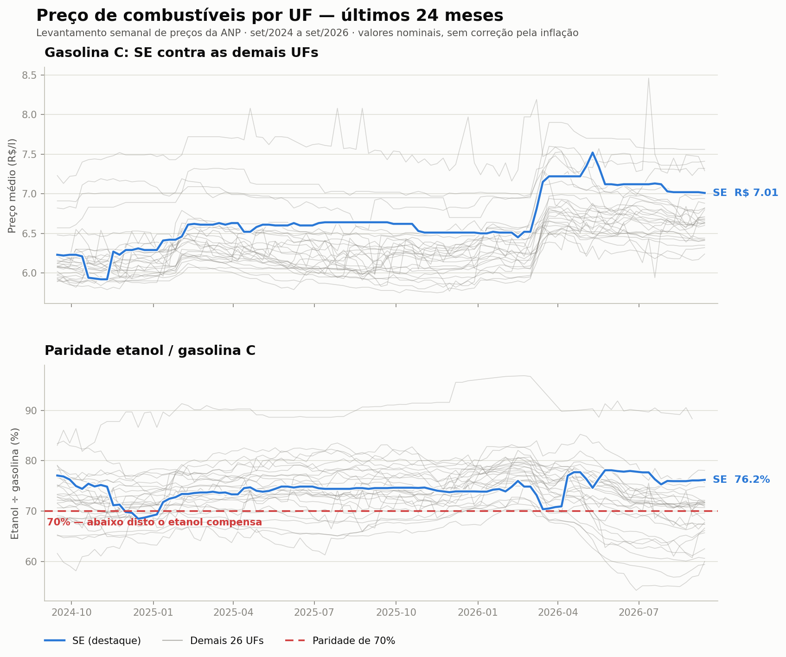

# Pipeline de preços de combustíveis da ANP

Pipeline ETL semanal que transforma a série histórica do Levantamento de Preços
da ANP numa tabela analítica consultável, com testes de qualidade que rodam a
cada carga.

## A pergunta do projeto

**Como o preço da gasolina C e do etanol hidratado evolui por estado, e em quais
UFs a paridade etanol/gasolina fica abaixo de 70%?**

Os 70% são o ponto de equilíbrio prático: como o etanol rende menos por litro,
ele só compensa no bolso quando custa menos de 70% do preço da gasolina.

### O que os dados respondem

Na semana de **13/09/2026**, **12 das 27 UFs** estavam abaixo da paridade de 70% —
ou seja, em pouco menos da metade do país o etanol compensava:

| UF | Região | Paridade |
|---|---|---|
| SP | Sudeste | 59,4% |
| MT | Centro-Oeste | 60,0% |
| MS | Centro-Oeste | 60,6% |
| PR | Sul | 62,5% |
| GO | Centro-Oeste | 65,7% |
| DF | Centro-Oeste | 66,1% |
| MG | Sudeste | 66,6% |
| BA | Nordeste | 67,4% |
| SC | Sul | 67,4% |
| AC | Norte | 67,8% |
| RO | Norte | 68,2% |
| PA | Norte | 69,6% |

O recorte não é aleatório: são os estados produtores de cana e seus vizinhos.
Olhando os **últimos 24 meses**, a vantagem é estrutural, não circunstancial —
**MS ficou abaixo de 70% em 95% das semanas**, SP em 89%, MT em 88% e PR em 86%.

**Sergipe fica do lado oposto.** Nos últimos 24 meses a paridade sergipana ficou
abaixo de 70% em apenas **6 das 105 semanas**, com média de **74,4%**. Na última
semana estava em **76,2%**, com a gasolina a R$ 7,01 — o 5º preço mais caro do
país. Em Sergipe, abastecer com etanol quase nunca compensou no período.



## Fonte

[Série histórica do Levantamento de Preços da ANP](https://www.gov.br/anp/pt-br/assuntos/precos-e-defesa-da-concorrencia/precos/precos-revenda-e-de-distribuicao-combustiveis/serie-historica-do-levantamento-de-precos),
planilha `semanal-estados-desde-2013.xlsx`.

A ANP **não expõe API REST**. Publica uma planilha XLSX de ~12 MB que sobrescreve
a cada semana, contendo a série inteira desde 30/12/2012 — 115 mil linhas, 706
semanas, preços médios de revenda por estado. O escopo desta v1 são os dois
produtos da pergunta: gasolina C e etanol hidratado, 37.919 linhas.

O arquivo tem 17 linhas de cabeçalho institucional e notas de rodapé antes do
cabeçalho real, na linha 18. A posição está no `config.toml` mas **é validada a
cada execução**, nunca assumida.

## Fluxo

```
   ANP (XLSX cumulativo, ~12 MB)
              │
              │  requests + retry com backoff exponencial
              │  guard: assinatura ZIP e tamanho mínimo
              ▼
   ┌──────────────────────┐
   │  data/raw/           │   arquivo como veio, nome com data de coleta
   │  *.xlsx + manifesto  │   manifesto JSONL: sha256, bytes, origem
   └──────────┬───────────┘
              │  valida cabeçalho → ErroEsquema se divergir
              │  normaliza: GASOLINA COMUM→GASOLINA C, estado→UF, "-"→nulo
              ▼
   ┌──────────────────────┐
   │  data/staging/       │   Parquet tipado, 379 KB
   │  precos_semanais     │   grão da fonte preservado, sem agregação
   └──────────┬───────────┘
              │  INSERT ... ON CONFLICT DO UPDATE, em transação
              ▼
   ┌──────────────────────┐
   │  data/mart/          │   fato_precos_semanais
   │  anp.duckdb          │   PK (data_inicio, uf, produto)
   └──────────┬───────────┘
              │
              ▼
   ┌──────────────────────────────────────────────┐
   │  Testes de qualidade                         │
   │  1. chave primária sem duplicata    bloqueia │
   │  2. preço médio entre R$ 1 e R$ 15  bloqueia │
   │  3. cobertura de UFs, por produto   bloqueia │
   │  4. variação semanal > 15%          alerta   │
   └──────────────────────────────────────────────┘
```

A tabela do mart tem granularidade **semana × UF × produto**:

`data_inicio`, `data_fim`, `uf`, `regiao`, `produto`, `preco_medio`, `preco_min`,
`preco_max`, `desvio_padrao`, `numero_postos`, `data_ingestao`

## Como rodar

```bash
python3 -m venv .venv && source .venv/bin/activate
pip install -r requirements.txt
export PYTHONPATH=src
```

```bash
# pipeline completo: baixa, transforma, carrega e valida
python -m anp.pipeline

# reaproveita um arquivo já baixado, sem acessar a ANP
python -m anp.pipeline --usar-raw data/raw/semanal-estados_2026-09-19.xlsx

# valida uma semana específica em vez da mais recente
python -m anp.pipeline --semana 2026-01-04

# gráfico da série por UF, com Sergipe destacado
python scripts/gerar_grafico.py

# testes
pytest
```

Códigos de saída: `0` sucesso (alertas não reprovam), `1` falha de qualidade,
`2` falha operacional.

Consultando o mart direto:

```bash
duckdb data/mart/anp.duckdb "SELECT * FROM fato_precos_semanais LIMIT 5"
```

### Automação

O workflow `.github/workflows/pipeline-semanal.yml` roda **toda quarta-feira às
12:00 UTC** (09:00 em Brasília) e também sob demanda. Ele executa os testes
automatizados, o pipeline e o gráfico; **qualquer teste de qualidade que falhe
derruba o job**, e o motivo aparece como tabela no resumo da execução, sem
precisar abrir o log. O banco, o Parquet, o gráfico e o log sobem como artefato.

## Decisões de projeto

**Full refresh, não carga incremental.** A fonte é cumulativa: cada coleta traz
as 706 semanas. Isso elimina qualquer estado a preservar entre execuções, o que
é exatamente o que um runner efêmero de CI precisa — não há manifesto, SHA nem
banco a versionar no repositório. Também absorve de graça revisões retroativas
da ANP.

**Idempotência em duas camadas.** O mart usa `INSERT ... ON CONFLICT DO UPDATE`
sobre a chave primária, dentro de transação: a terceira execução seguida produz
0 linhas novas e 0 duplicatas. Na camada raw, coletas com SHA-256 idêntico
reaproveitam o arquivo anterior em vez de acumular cópias de 12 MB por semana.

**"Gasolina C" não existe na fonte.** O rótulo da ANP é `GASOLINA COMUM`, e
`GASOLINA ADITIVADA` é um produto separado, fora do escopo. A tradução fica no
`config.toml`, não no meio do código.

**Falha explícita quando o esquema muda.** A validação de cabeçalho não só
compara as colunas: se não encontrar o cabeçalho onde esperava, procura nas
linhas vizinhas e diz qual ajuste fazer — *"encontrado na linha 20, ajuste
extracao.linha_cabecalho"*. Coluna renomeada é reportada nomeando a que sumiu e
a que apareceu. Nenhum `except` silencioso no projeto.

**Cobertura de UF é testada por produto, não globalmente.** Uma regra global de
"27 UFs sempre" falharia por dado correto: a ANP não pesquisa etanol no Amapá em
boa parte das semanas. Cada produto tem sua allowlist de ausências estruturais
em `[qualidade.ufs_ausentes_toleradas]`, e a allowlist não vaza entre produtos —
AP faltando na gasolina reprova, mesmo sendo tolerado no etanol.

**Variação semanal é alerta, não erro.** Preço de combustível oscila de verdade;
derrubar a carga por isso treinaria qualquer pessoa a ignorar o workflow
vermelho.

**A comparação semanal usa `LAG`, não `data - 7 dias`.** A série tem três
descontinuidades reais, e subtrair sete dias compararia contra semana
inexistente nesses pontos. O `LAG` sobre as semanas ordenadas de cada
`(uf, produto)` pega a anterior que existe, e o resultado informa a distância em
dias para o analista saber que houve buraco.

**Configuração em arquivo, em TOML.** Lido com `tomllib` da biblioteca padrão,
sem dependência extra de parser. URL, limiares, mapa de UFs, allowlists e
parâmetros do gráfico ficam todos lá.

**Logging estruturado em JSON Lines.** Cada etapa emite eventos com campos
fixos, legíveis tanto no terminal quanto no Actions — e é o que alimenta o
resumo da execução.

**O gráfico não dá 27 cores a 27 UFs.** Nenhuma paleta categórica suporta isso
com legibilidade. As demais UFs formam uma faixa de contexto em cinza e só
Sergipe carrega cor. A paleta foi validada para daltonismo e contraste.

## Limitações conhecidas

### Valores nominais

A série tem quase 14 anos e **os preços não são deflacionados** — são exatamente
os que a ANP publicou, para manter fonte única e rastreável. Comparar 2013 com
2026 diretamente é enganoso: boa parte da alta é inflação.

Por isso **o gráfico e a conclusão acima usam janela de 24 meses**, onde o efeito
é pequeno. O mart carrega a série completa para quem quiser deflacionar por
fora. **A paridade etanol/gasolina é imune ao problema**, por ser razão entre dois
preços do mesmo instante, e pode ser lida em toda a série.

### Ausências na fonte

Das 38.124 combinações possíveis (706 semanas × 27 UFs × 2 produtos), **205 não
existem**. Elas se dividem em dois tipos, e a distinção importa:

**Ausência estrutural — 180 casos.** A ANP não pesquisa etanol hidratado no
**Amapá** na maior parte do tempo: falta em 180 das 706 semanas, incluindo a mais
recente. É o único caso na allowlist, e por isso o AP aparece com frequência
fora do painel de paridade.

**Ausências episódicas — 25 casos**, deliberadamente *não* silenciadas:

| Quando | O que faltou | Causa |
|---|---|---|
| 27/05/2018 | Etanol em PE, RR, SC e TO | Greve dos caminhoneiros; desabastecimento generalizado |
| 25/12/2022, 01/01/2023, 14/12/2025 | Acre inteiro, os dois produtos | Semanas de Natal e Ano-Novo sem pesquisa de campo |
| 08/08/2021 e 09/10/2022 | DF e RR inteiros | Semana sem coleta na UF |
| 28/12/2025 a 18/01/2026 | **Gasolina no Amapá, 4 semanas seguidas** | Sequência sem pesquisa; a mais longa da série recente |
| outras | Etanol em RR (6×), AC, PE, SC, TO, DF | Pontuais |

**A gasolina do Amapá não entrou na allowlist, por decisão de projeto.** São 6
ocorrências em 706 semanas — episódico, não estrutural. Silenciar trocaria um
falso positivo visível por um falso negativo permanente, e um mart com buraco
silencioso é pior que um workflow vermelho. Se a sequência de janeiro de 2026 se
repetir, **o job de quarta-feira vai falhar**, e isso é intencional: exige olhar
humano para decidir se a ANP não pesquisou ou se a extração quebrou.

### Descontinuidades na série

Três saltos entre semanas consecutivas, tratados pelo `LAG`:

| De | Para | Intervalo |
|---|---|---|
| 09/08/2015 | 23/08/2015 | 14 dias |
| **16/08/2020** | **18/10/2020** | **63 dias** — suspensão do levantamento na pandemia |
| 11/09/2022 | 25/09/2022 | 14 dias |

### Escopo e granularidade

- Só **gasolina C e etanol hidratado**. Diesel, GLP, GNV e gasolina aditivada
  estão na fonte mas fora da v1.
- Só **preço de revenda** (o que o consumidor paga). As colunas de distribuição
  existem no arquivo, vêm majoritariamente como `-` e não foram carregadas.
- Granularidade **estadual**. A média de uma UF esconde dispersão entre
  municípios e entre postos; `preco_min`, `preco_max` e `desvio_padrao` estão no
  mart justamente para dar essa noção.
- **Dados por posto revendedor estão fora do escopo**, assim como Docker, dbt,
  Airflow e dashboard.
- O número de postos pesquisados **varia por semana e por UF**, então a precisão
  da média não é uniforme entre estados.

### Operacionais

- O servidor da ANP não envia `Last-Modified` nem `ETag`, então não há como
  saber se houve republicação sem baixar os 12 MB e comparar o hash.
- Uma resposta HTML com HTTP 200, que o gov.br às vezes devolve, é retentada
  até esgotar o backoff antes de falhar — custa ~30 s quando a URL muda de vez.
- Os testes de qualidade avaliam **a semana carregada**, não a série inteira.
  Uma anomalia antiga que entre numa revisão retroativa da ANP não é detectada.
